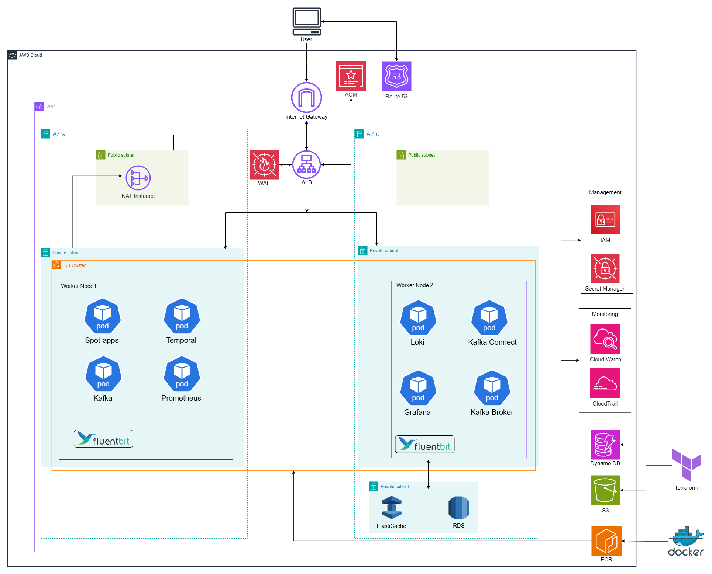

<div align="center">
 <h1> Spot </h1>
 <p>픽업 주문 서비스를 위한 MSA 기반 백엔드 프로젝트</p>
</div>

## 프로젝트 소개

종로구 혜화동 근처에서 운영중인 음식점들의 픽업 주문 관리, 결제, 그리고 주문 내역 관리 기능을 제공하는 플랫폼입니다.

## 시작 가이드

### 요구사항

- Java 21 / Spring Boot 3.5.9 / Spring Cloud 2025.0.1
- PostgreSQL, Redis, Kafka, Temporal
- Kubernetes 1.35 (EKS / k3d), Terraform, Helm, Kustomize, ArgoCD (GitOps)
- Prometheus, Grafana, Loki, fluent-bit
- k6 (부하 테스트)

### 팀 컨벤션

아래 명령어를 이용하여 convention을 지켜주세요

```bash
git config core.hooksPath .githooks
```

### 로컬 Docker Compose 실행

아래 명령어를 통해 쉽게 도커 컨테이너에서 사용할 수 있습니다.

```bash
./gradlew clean build -x test
docker-compose up --build -d
```

PostgreSQL, Redis, Kafka(KRaft 3-broker), Kafka Connect, Temporal 및 전체 서비스가 함께 기동됩니다.

### 로컬 k3d 실행

```bash
./k8s/bootstrap/k3d-cluster-init.sh  # k3d 클러스터 생성
./k8s/bootstrap/deploy-argo.sh       # ArgoCD 설치 + root App 배포 (App-of-Apps)
./k8s/deploy/local-build-img.sh      # 서비스 이미지 빌드 및 로컬 레지스트리 push
```

> ⚠️ `deploy-argo.sh` 실행 전에 `k8s/base/common-config/.env` 파일이 필요합니다 (Secret 생성용, gitignore 대상). 아래 키에 값을 채워 생성하세요.

<details>
<summary><code>.env</code> 예시 (값은 직접 채워주세요)</summary>

```ini
# [PostgreSQL]
SPRING_DATASOURCE_URL=
SPRING_DATASOURCE_USERNAME=
SPRING_DATASOURCE_PASSWORD=
DB_HOST=
DB_NAME=

# [Redis]
SPRING_DATA_REDIS_HOST=
SPRING_DATA_REDIS_PORT=

# [Kafka]
KAFKA_BOOTSTRAP_SERVERS=

# [Temporal]
SPRING_TEMPORAL_CONNECTION_TARGET=

# [JWT]
SPRING_JWT_SECRET=
SPRING_JWT_EXPIRE_MS=

# [EMAIL]
EMAIL_USERNAME=
EMAIL_PASSWORD=

# [TOSS]
TOSS_CUSTOMER_KEY=
TOSS_SECRET_KEY=

# [Feign]
FEIGN_USER_URL=
FEIGN_ORDER_URL=
FEIGN_STORE_URL=
FEIGN_PAYMENT_URL=

SPOT_USER_URI=
SPOT_STORE_URI=
SPOT_ORDER_URI=
SPOT_PAYMENT_URI=
```

</details>

> 더미 데이터와 함께 실행하려면 [data/README.md](./data/README.md)를 참고하세요.

## Project Structure

| 디렉터리                                                   | 설명                                                                                                      |
| ---------------------------------------------------------- | --------------------------------------------------------------------------------------------------------- |
| `spot-gateway`                                             | Spring Cloud Gateway (라우팅, 인증/인가)                                                                  |
| [`spot-user`](./spot-user/README.md) / [`spot-store`](./spot-store/README.md) / [`spot-order`](./spot-order/README.md) / [`spot-payment`](./spot-payment/README.md) | 도메인 서비스 (링크 = 도메인별 README)                                                                    |
| `spot-mono`                                                | 모놀리식 통합 모듈                                                                                        |
| `FE`                                                       | 프론트엔드                                                                                                |
| `config`                                                   | 공통 Spring 설정(yml) — Docker Compose 실행 시 사용 (`./config:/config` 마운트)                           |
| `k8s`                                                      | Kustomize(base/overlays) + Helm 차트(spot-apps), ArgoCD App-of-Apps(argo/), k3d 부트스트랩, 배포 스크립트 |
| `k8s/base/common-config`                                   | 클러스터용 설정·시크릿 소스 — k3d 실행 시 ConfigMap·Secret으로 생성 (kustomize generator)                 |
| `terraform`                                                | AWS 인프라 IaC (modules + environments) — [실행 가이드](./terraform/README.md)                            |
| `k6`                                                       | 부하 테스트 스크립트                                                                                      |
| `docs`                                                     | 기능 문서                                                                                                 |

## Application Flow


### 서비스 구성

| 서비스          | 포트 | 역할                         |
| --------------- | ---- | ---------------------------- |
| API Gateway     | 8080 | 라우팅, 인증/인가            |
| User Service    | 8081 | 회원 가입, 로그인, 정보 수정 |
| Order Service   | 8082 | 주문 생성, 주문 조회         |
| Store Service   | 8083 | 매장 및 메뉴 조회            |
| Payment Service | 8084 | 결제 처리, PG 연동           |

### 주요 흐름

1. **회원 관리**: API Gateway → User Service → User DB
2. **매장/메뉴 조회**: API Gateway → Store Service → Store/Menu DB (Redis 캐싱)
3. **주문 생성**: API Gateway → Order Service → 사용자/가게/메뉴 유효성 검증 → Order DB
4. **결제 처리**: Order Service → Payment Service → TossPG 승인/취소 API 호출
5. **결제 결과**: TossPG Webhook → Payment Service → Kafka → 결제 결과 확정

### 서비스 간 통신

- **동기 통신**: OpenFeign을 통한 REST API 호출 (Resilience4j 서킷 브레이커 적용)
- **비동기 통신**: Kafka를 통한 이벤트 기반 메시징
- **워크플로 오케스트레이션**: Temporal을 통한 주문/결제 워크플로 관리
- **캐싱**: Redis(ElastiCache)를 통한 메뉴/매장 정보 캐싱

## Infrastructure

AWS Dev 환경 기준입니다. Terraform으로 프로비저닝하며 EKS 위에서 운영됩니다. (Prod 환경은 추후 구성 예정)



### 네트워크 구성

- **Region**: ap-northeast-2 (서울)
- **VPC**: 10.0.0.0/16, 2개의 Availability Zone (AZ-a, AZ-c)
- **Public Subnet**: NAT Instance, ALB
- **Private Subnet**: EKS, RDS, ElastiCache

### 트래픽 흐름

```
User → Route 53 → ALB (AWS Load Balancer Controller) → Spring Cloud Gateway → 각 서비스
```

### 컴퓨팅

- **EKS**
  - 5개 서비스 (Gateway, User, Store, Order, Payment) 및 인프라 워크로드(Kafka, Temporal, 모니터링) 배포
  - SPOT 노드 사용
- **AWS Load Balancer Controller**: Ingress 기반 ALB 자동 생성 및 트래픽 분산
- **ECR**: 컨테이너 이미지 저장소

### 배포 (GitOps)

- **ArgoCD**
  - App-of-Apps 패턴으로 `k8s/`의 매니페스트를 pull 방식으로 동기화
  - Terraform(`environments/argo`)으로 부트스트랩
- **GitHub Actions**: dev 머지 시 변경된 서비스만 빌드해 ECR push (OIDC 인증) — 클러스터 반영은 ArgoCD 담당

### 데이터베이스 및 메시징

- **RDS**: PostgreSQL 16 — Dev는 단일 공유 데이터베이스, Prod는 서비스별 독립 데이터베이스 예정
- **ElastiCache**: Redis 7 캐시
- **Kafka**: Strimzi Operator (KRaft 모드)
- **Temporal**: 워크플로 엔진

### 보안 및 관리

| 서비스          | 용도                                             |
| --------------- | ------------------------------------------------ |
| IAM             | 접근 권한 관리 (GitHub Actions OIDC 포함)        |
| WAF             | 웹 방화벽 (rate limiting)                        |
| Secrets Manager | RDS 마스터 암호 관리 (앱 시크릿은 ESO 도입 예정) |
| ACM             | TLS 인증서 관리                                  |

### 모니터링 및 로깅

- **Prometheus / Grafana**: 메트릭 수집 및 대시보드 (서비스·Kafka·Temporal 모니터링)
- **Loki / fluent-bit**: 로그 수집 및 조회
- **CloudWatch / CloudTrail**: AWS 리소스 모니터링 및 감사 로그
- **S3**: 정적 파일, ALB 액세스 로그 및 백업 스토리지

### Terraform 폴더 구조

```
terraform/
├── environments/
│   ├── bootstrap/   # tfstate용 S3 + DynamoDB lock (최초 1회, destroy 금지)
│   ├── dev/         # Dev 환경 (VPC, EKS, RDS 등)
│   └── argo/        # ArgoCD 루트 모듈 (dev 클러스터를 참조, 별도 state)
└── modules
    ├─acm
    ├─argocd
    ├─ecr
    ├─eks
    ├─github-oidc
    ├─network
    ├─rds
    ├─redis
    ├─route53
    ├─s3
    ├─security
    └─waf
```

> 루트 모듈별 역할과 실행(apply/destroy) 순서, ArgoCD 접속 방법은 [terraform/README.md](./terraform/README.md)를 참고하세요.
